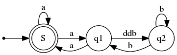

# RedisSourceCode
Redis3.0源码注解

```go
func moveZeroes(nums []int)  {
	zeroCount, numLen := 0, len(nums)
	for i := 0; i < numLen; i++ {
		if nums[i] == 0 {
			zeroCount++
		} else {
			if zeroCount > 0 {
				nums[i - zeroCount] = nums[i]
			}
		}
	}

	for i := numLen - zeroCount; i < numLen; i++ {
		nums[i] = 0
	}
	fmt.Println(nums)
}
```

